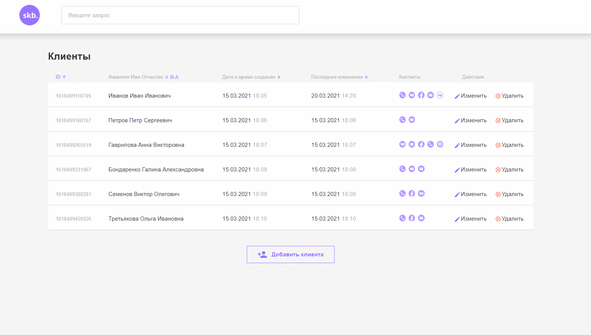
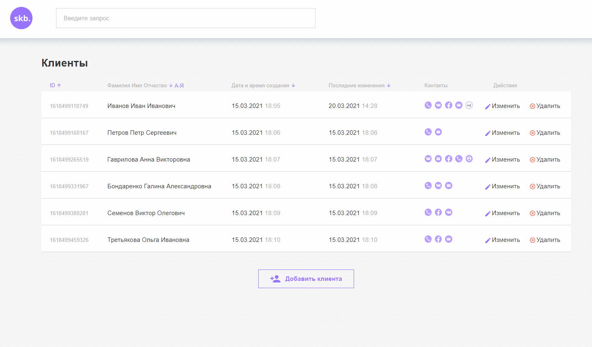

# Web-интерфейс для CRM.

## Запуск

Для запуска сервера необходимо перейти в папку crm-backend и воспользоваться командой:
```
node index
```
Для работы с интерфейсом необходимо запустить (в корневой директории репозитория):

***index.html***

## Описание.

Интерфейс представляет из себя страницу, на которой располагается:

+ таблица клиентов
+ кнопка для добавления нового клиента
+ шапка с логотипом компании и строкой поиска клиентов.




## Функционал.

+ Просмотр списка клиентов в виде таблицы
+ Сортировка
+ Поиск
+ Добавление нового клиента
+ Изменение информации о существующем клиенте (ФИО и контактная информация)
